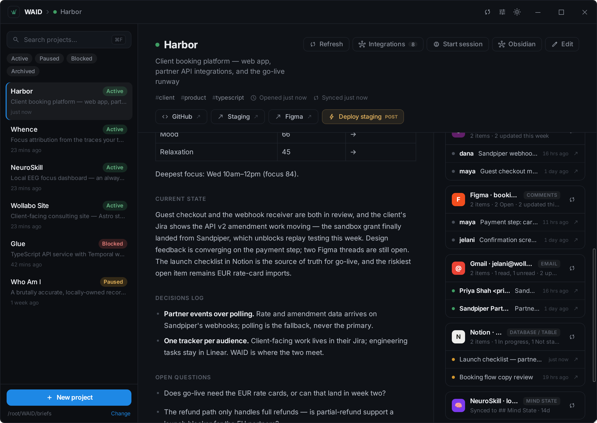

# WAID — What Am I Doing?

A local-first desktop dashboard for the macro state of all your projects.
Where *What's Next?* answers "what task now?", WAID answers **"what's the
state of everything?"**


[https://wollabo.com/tools/waid](https://wollabo.com/tools/waid)


Each project is one markdown file — a **brief**. WAID lists them, renders each
brief, pulls live state from its integrations, and lets you launch into work:
open links, fire webhooks, jot quick captures. Optionally, a local or cloud
LLM synthesizes a prose summary. Single-user, local, desktop-only by design.



## Why

- **Local-first, for real** — no server, no cloud DB, no auth. Just markdown
  files in a folder on disk.
- **Portable forever** — plain frontmatter + markdown. If WAID disappears,
  your briefs still open in any editor.
- **Obsidian-native** — point the briefs folder at a vault: wikilinks render,
  backlinks show, and a button deep-links into Obsidian.
  See [docs/obsidian.md](docs/obsidian.md).

## Quick start

Prerequisites: **Node 18+** with **pnpm**, **Rust** (stable), and Tauri's
platform deps — see
[tauri.app/start/prerequisites](https://v2.tauri.app/start/prerequisites/).

```bash
pnpm install
pnpm tauri dev      # desktop app with hot reload (pnpm tauri:wsl under WSL)
pnpm tauri build    # native bundle in src-tauri/target/release/bundle
```

`pnpm check` type-checks the frontend; `cargo test` (from `src-tauri/`) runs
the backend tests.

## The briefs folder

WAID reads every `.md` in the configured briefs directory — default
`~/WAID/briefs`, seeded with samples on first run; change it from the sidebar
(e.g. to an Obsidian vault — it scans recursively and skips dot-folders).

```markdown
---
name: Sample Web App
status: active            # rendered as a pill; archived briefs hide by default
tags: [sample, web]
links:
  - label: GitHub
    url: https://github.com/...
webhooks:
  - id: deploy-staging
    label: Deploy staging
    url: https://...
connections:              # PM connections — metadata only; tokens live in the OS keyring
  - id: linear-personal
    provider: linear
integrations:
  - connection: linear-personal
    kind: tasks
    query: "assignee:me"
---

# Project context
...
```

Full frontmatter reference (webhook headers, `{{secret}}`, app-owned regions):
[docs/brief-format.md](docs/brief-format.md).

## Features

- **Two-pane layout** — project sidebar (status pills, search **⌘/Ctrl+F**,
  status filters) + detail pane, under a custom titlebar with *Sync all* and
  the appearance menu (theme, accent, density, brief layout).
- **Markdown rendering + edit mode** — ⌘/Ctrl+S saves; edits round-trip the
  whole file, so frontmatter is never mangled.
- **Brief bootstrap** — generate a new brief from a local folder, a GitHub
  URL, a 3-question interview, or a pasted AI handoff prompt; always lands as
  a proposal in edit mode, nothing saved until you say so.
- **Launch row** — link buttons, *Open in Obsidian*, and webhook buttons
  (custom headers, keyring-backed `{{secret}}`).
- **Quick capture** — **⌘/Ctrl+K** (or global **Ctrl+Shift+Space**) appends a
  timestamped note under a project's `## Captures`.
- **Brief sync** — pull open PRs/issues, last push, CI, and latest release
  from a brief's GitHub link into a managed `## Activity` block.
  Deterministic; your prose is never touched.
- **PM integrations** — connect a brief to **Linear, Jira, Asana, GitHub,
  Notion, Gmail, Slack, or Figma** and see your live tasks / notifications /
  messages / comments inline with a local rollup. Strictly additive — a failed
  fetch is a toast, never a write. Setup guides:
  [docs/integrations.md](docs/integrations.md).
- **Mind State** — connect a local
  **[NeuroSkill](https://github.com/NeuroSkill-com/skill)** EEG dashboard and get a
  deterministic `## Mind State` region aggregating focus / engagement / mood
  over your labeled work sessions. [docs/mind-state.md](docs/mind-state.md).
- **AI synthesis, digests & morning briefing** _(optional)_ — with Ollama
  (local) or Anthropic configured, Refresh writes a `## Current State` +
  `## Open Questions` summary into app-owned regions, and you can digest one
  brief's PM items or brief across all projects. All fetched content is data,
  never instructions. [docs/synthesis.md](docs/synthesis.md).
- **Secrets in the OS keyring** — every token, key, and grant lives in the
  platform keychain, never in settings, env, or the `.md` files.
  Key formats: [docs/integrations.md](docs/integrations.md#secret-storage).

## Stack

[Tauri 2](https://v2.tauri.app/) (Rust backend) ·
[SvelteKit](https://svelte.dev/) (Svelte 5, TypeScript, SPA) ·
[Tailwind CSS v4](https://tailwindcss.com/) · plain `reqwest` JSON (no
provider SDKs) · OS keyring · `.md` files on disk. Architecture deep-dive:
[waid-project-summary.md](waid-project-summary.md).

## Out of scope

Mobile/web versions, auth, multi-user, and sync are **not** planned — WAID is
single-user, local, desktop-only by design. Still on the v1 list:
drag-to-reorder, a richer markdown editor, a dedicated quick-capture window,
in-process inference, and a due-date signal in the integration rollup.
